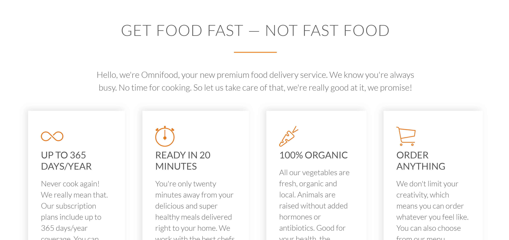
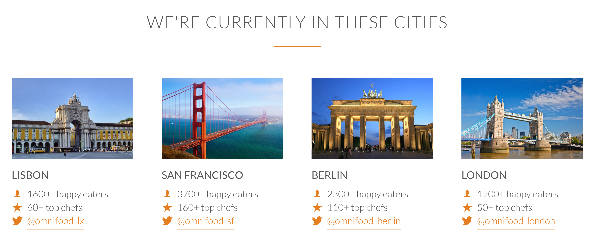
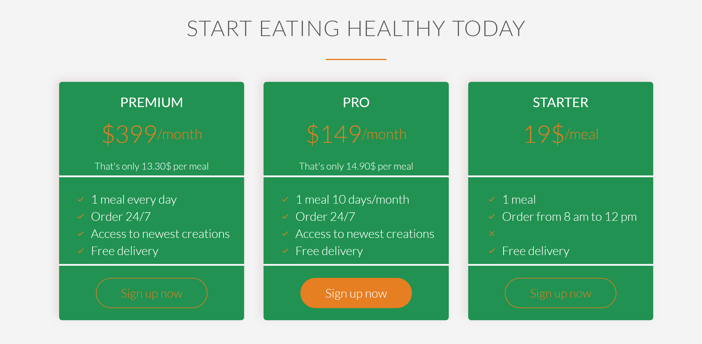

# Omnifood-Learn-CSS

###### **Responsive** Pages | Learn CSS Flexbox | Killer website

A fully responsive webpage using CSS Flexbox demonstrating a Food Delivery website.

This webpage was created based on the course "Design and Develop a Killer Website Using HTML5 and CSS3" by Jonas Schmedtmann. 

**Compared to the original course I have used CSS Flexbox to align content and achieve similar Look and Feel**.

**Happy Learning !!!.**

###### Build a Dashing Site header - Learn about overlay with background image.

  

###### Build a Info Card - Learn to create Info card with shadow effect using Flexbox.

  

  ###### Build image Card - Learn to create Cards with Image and social media information.
  

  
  ###### Build beautiful Cards - Learn how Flexbox can be used to create beautiful responsive Cards.
  

  ### https://maindolaamit.github.io/Omnifood-Learn-CSS/

